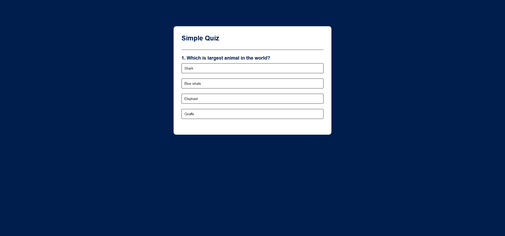

# Simple Quiz - Web App

This is a basic quiz web application developed using HTML5, CSS3, and JavaScript. The app presents multiple-choice questions, calculates the score, and displays it at the end of the quiz.

## Features

- **Multiple Choice Questions**: Each question comes with multiple answers, out of which only one is correct.
- **Score Calculation**: The app keeps track of your score and shows the result at the end.
- **Interactive Feedback**: Correct and incorrect answers are visually highlighted.
- **Play Again**: Users can restart the quiz after completing it.

## Technologies Used

- **HTML5**: Structure of the app.
- **CSS3**: Styling of the app, with dynamic hover effects and responsiveness.
- **JavaScript**: Logic for question display, answer selection, score calculation, and restarting the quiz.

## How to Use

1. Open the `index.html` file in your web browser.
2. The first question will be displayed with multiple answers.
3. Select an answer, and it will be highlighted as correct or incorrect.
4. Click the "Next" button to proceed to the next question.
5. After answering all questions, your score will be displayed.
6. You can click "Play Again" to restart the quiz.

## Project Files

- `index.html`: Contains the structure of the quiz.
- `style.css`: Provides the design and layout of the app.
- `script.js`: Contains the logic for displaying questions, checking answers, and calculating the score.

## Screenshot



## Future Improvements

- Adding more questions.
- Introducing categories or difficulty levels.
- Including a timer for each question.
- Providing more detailed feedback on incorrect answers.

## Setup and Installation

1. Clone the repository.
   ```bash
   git clone https://github.com/bahaamohammed/Quiz-Web-App.git